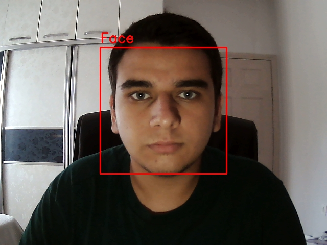

# **Face Detection and Saving Images from Camera**

This Python script captures video from your camera, detects faces in real-time, and saves detected faces as image files. It uses the OpenCV library for face detection and processes video streams directly from your computer's camera. Detected faces are saved in the `faces` folder to prevent redundant captures of the same face by using a hash function.

## **How it Works**

1. **Camera Capture**: The script captures video using your computer’s camera.
2. **Face Detection**: It uses OpenCV's pre-trained Haar Cascade model to detect faces in real-time.
3. **Save Faces**: Each detected face is saved in the `faces` folder, with a unique image file for each new face.
4. **Display**: Faces are outlined in a rectangle on the video feed to visually indicate detection.
5. **Exit**: Press `q` to exit the application.

## **Required Libraries**

To run this script, you need the following Python libraries. You can install them with the command below:

```bash
pip install opencv-python
```

## **Usage Instructions**

1. Clone this repository or download the script.
2. Make sure you have a working camera connected to your system.
3. Run the script using Python:

   ```bash
   python facebaris.py
   ```

4. Press `q` to exit the video stream at any time.

## **Sample Photo and Video**

- Below is an example of a detected face being outlined in the video stream:

   

- You can download and view the example video showing how the face detection works:

   [Sample Video](smp/samplevideo.mp4)
  

## **Project Structure**

project_folder/ 
- facebaris.py (# The Python face detection script)
- smp/samplephoto.jpg, samplevideo.mp4 (# Folder containing sample images and videos)

## ✈️**Project management and coding provided by: Baris Degerli**
